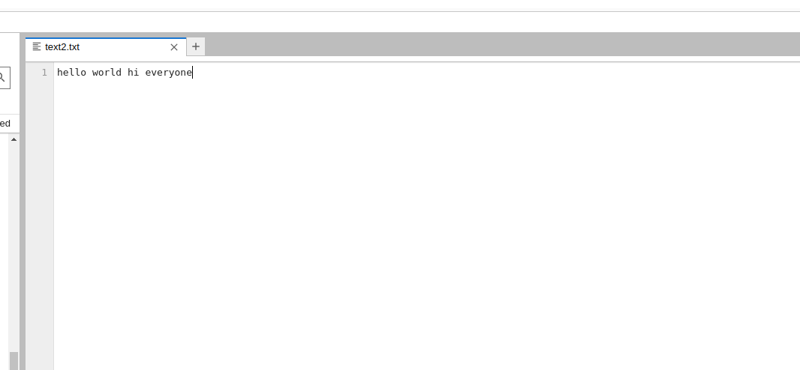

# Word-count
## AIM:
To write a python program for getting the word count from a text.
## EQUIPEMENT'S REQUIRED: 
PC
Anaconda - Python 3.7
## ALGORITHM: 
### Step 1: Decare a variable count equal to 0.

### Step 2: Open the required text file in read mode as text.(any name can be used).
 
### Step 3: Look until variable i in file text.

### Step 4:  Declare variable word = i.split().

### Step 5: Process count+=len(word) End loop

### Step 6: Print the value of count,which has the number of words in the file.

## PROGRAM:
``` python
num=0
with open('text2.txt','r') as f1:
    for i in f1:
        w= i.split()
        num+= len(w)
print("number of words={}".format(num))
```
        
### OUTPUT:



## RESULT:
Thus the program is written to find the word count from a text.
